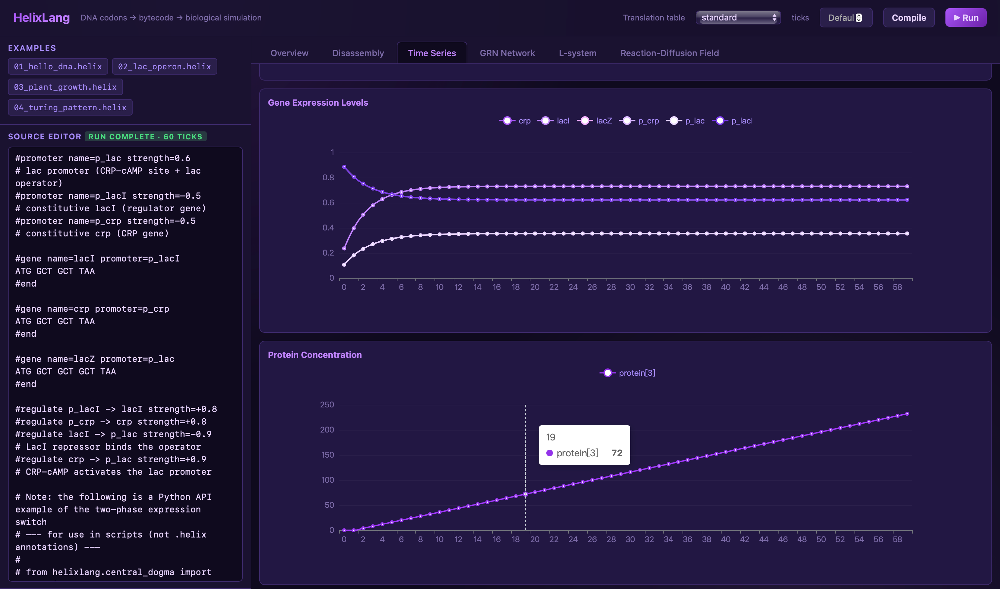

<div align="center">

# 🧬 HelixLang

_"We are moving from reading the genetic code to writing it. " — J. Craig Venter_

**DNA is source code. Codons are mnemonics. The ribosome is a VM. The cell is the runtime.**

A domain-specific language where biological genetic material is the source, binary bytecode is the intermediate representation, and the execution semantics simulate biological behavior and morphology.

[Quick Start](#quick-start) ·
[Examples](#language-examples) ·
[Architecture](#architecture) ·
[API](#api--web-visualization) ·
[IDE Plugin](#ide-plugin-pycharm) ·
[Documentation](#documentation) ·
[Contributing](#contributing) ·
[License](#license)



[](https://pypi.org/project/helixlang/)
[](https://pypi.org/project/helixlang/)

</div>

---

## Why HelixLang?

Traditional biological modeling tools treat DNA as **data** — a passive string to be analyzed. HelixLang treats DNA as **code**: every codon is an instruction, every gene is a function, every cell is a runtime.

```helix
#gene name=hello
ATG GCT GGT TAA          # START -> BUILD_PROTEIN -> BUILD_MEMBRANE -> HALT
#end
```

Feed that sequence to the HelixLang compiler and you get a real bytecode program you can run, debug, and disassemble — just like Python or Java bytecode.

### Highlights

- 🧬 **Biologically isomorphic** — language primitives map one-to-one to biological entities: codons, amino acids, genes, promoters, operons, regulators, proteins.
- ⚙️ **Full compiler pipeline** — Lexer → Parser → AST → Semantic → Compiler → Bytecode → VM, with disassembly and debugging support.
- 🎲 **Degeneracy as aliasing** — 64 codons map to ~30 opcodes; the third wobble position acts as an operand modifier, mirroring real biological degeneracy.
- 🌱 **Executable life** — bytecode drives a cell simulator that emits morphology (L-system / reaction-diffusion), behavior (move / signal), and state (concentration / energy).
- 🔬 **Real biological data** — mutation rates, transition:transversion ratios, codon usage tables, tRNA abundances, and CAI are sourced from published measurements (Lee 2012, Drake 1991, Ikemura 1985, Dong 1996, Sharp & Li 1987).
- 💾 **DNA data storage** — built-in Goldman 2013 rotating-key encoding (true base-3 Huffman, ~5.05 trits/byte) and Erlich-Zielinski 2017 DNA Fountain code, encoding arbitrary byte streams into synthesizable DNA.
- 🛠️ **No hard dependencies** — the core compiler/VM uses only the Python standard library; numpy / biopython / flask are optional enhancements.
- 🧪 **Frontier biology** — the frontier tier turns the simulator into a quantitative model: **programmable cells** (per-cell GRN + bytecode in a multicellular population), **stochastic gene expression** (telegraph two-state promoter, SSA, Fano-factor noise; Peccoud & Ycart 1995), **environment-coupled Monod metabolism** (Monod 1949; Kovárová-Kovar & Egli 1998) with CROMICS cell-crowding diffusion (PLOS Comput Biol 2021 e1009140/e1009158), **dynamic FBA** batch/diauxic simulation (Mahadevan 2002), and spatial cell mechanics — all grounded in `units.py`.

---

## 🚀 Quick Start

### Install

HelixLang is published on **PyPI** — install the released package:

```bash
# Core (compiler + VM + CLI)
pip install helixlang

# Recommended: install all optional extras
pip install "helixlang[fast,web,bio]"
```

> The core installs with **zero runtime dependencies** — only the Python standard library.
> Contributors working from a source checkout instead use `pip install -e ".[dev,fast,web,bio]"` (see [Contributing](#contributing)).

| Extra | Capability | Dependencies |
|-------|-----------|--------------|
| `fast` | vectorized mutation / reaction-diffusion speedup | numpy |
| `web` | Flask visualization frontend | flask |
| `bio` | physical DNA codec + IUPAC validation | biopython, reedsolo |
| `dev` | tests + coverage (source checkouts) | pytest, pytest-cov |

### Up and running in 30 seconds

```bash
# Run an example
helixlang examples/01_hello_dna.helix

# Disassemble the bytecode
helixlang examples/01_hello_dna.helix --disassemble

# Launch the web visualization (http://127.0.0.1:5000)
helixlang --serve
```

### As a Python library

```python
from helixlang.lexer import Lexer
from helixlang.parser import Parser
from helixlang.compiler import Compiler
from helixlang.vm import CellVM
from helixlang.codon_table import get_table

src = "#gene name=hello\nATG GCT GGT TAA\n#end\n#config ticks=10\n"

table = get_table("standard")
tokens = list(Lexer(src).tokens())
program = Parser(tokens).parse()
chunk = Compiler(table).compile(program)

vm = CellVM(chunk, program)
trace = vm.run(program.config.ticks)
print(f"Ran {len(trace)} ticks, final energy = {trace[-1]['energy']}")
```

---

## 🧬 IDE Plugin (PyCharm)

Write, inspect, and debug `.helix` programs right inside **PyCharm 2022.2+** (Community or
Professional) with the sibling repository
**[SeanHank/HelixLang-LSP-Plugin](https://github.com/SeanHank/HelixLang-LSP-Plugin)**: live
diagnostics, hover docs, completion, navigation, semantic highlighting, inlay hints, a bytecode
disassembler, and a line debugger, all over Language Server Protocol.

Install the language server (once, per Python interpreter):

```bash
pip install helixlang-lsp
```

Then grab the plugin zip from that repo's [Releases](https://github.com/SeanHank/HelixLang-LSP-Plugin/releases)
page and install it via **Settings → Plugins → ⚙ → Install Plugin from Disk…**. Full install steps,
build-from-source instructions, and the design docs live in the
[plugin README](https://github.com/SeanHank/HelixLang-LSP-Plugin).

---

## 🌟 Language Examples

### 1. The lac Operon — Gene Regulatory Network (GRN)

p_lacI constitutively expresses lacI → represses p_lac → lacZ/lacY shut off. A real negative-feedback loop:

```helix
#promoter name=p_lac  strength=0.5
#promoter name=p_lacI strength=-0.5

#gene name=lacZ promoter=p_lac
ATG GCT GCT GCT TAA
#end

#gene name=lacI promoter=p_lacI
ATG GCT GCT TAA
#end

#regulate lacI  -> p_lac  strength=-0.9     # lacI represses p_lac
#regulate p_lac -> lacZ  strength=+0.9      # p_lac activates lacZ

#config ticks=20 output=csv
```

### 2. Turing Patterns — Gray-Scott Reaction-Diffusion

```helix
#promoter name=p_pigment strength=-0.4
#gene name=pigment promoter=p_pigment
ATG GAT GAT GAA TAA
#end

#field size=32 F=0.035 k=0.065 Du=0.16 Dv=0.08

#config ticks=100 react_steps=2
```

Render the output to a PPM image: `helixlang examples/04_turing_pattern.helix --png turing`

### 3. CRISPR-Cas9 Gene Editing

```helix
#gene name=target_gene
ATG GCT GCT GCT GCT GCT GCT GCT GCT GCT TAA
#end

#crispr target=target_gene position=50 new_sequence="GGGG" cas=SpCas9 repair=HDR
```

Equivalent Python API call:

```python
from helixlang.crispr import design_guide, cut_dna, on_target_score

guide = design_guide("ATCGATCGATCGATCGATCGGATC", cas_variant="SpCas9")
print(f"On-target score: {on_target_score(guide):.3f}")
edited = cut_dna("ATCGATCGATCGATCGATCGGATC", guide, repair="NHEJ")
```

### 4. Evolution Simulation — Mutation + Selection + Drift

```helix
#gene name=ancestor
ATG CTG CTG CTG CTG CTG CTG CTG CTG CTG TAA
#end

#evolve target=ancestor generations=100 mutation_rate=0.01 population_size=1000
```

Parameters come from real papers: E. coli substitution rate 2.2e-10 /nt/gen (Lee 2012), transition:transversion ≈ 3:1 (Stoltzfus 2009).

### 5. DNA Data Storage — Write source code into DNA

```bash
# .helix source -> DNA sequence (Goldman rotating-key encoding)
helixlang examples/01_hello_dna.helix --encode-dna goldman

# High-density fountain code (~1.57 bit/nt, near the Shannon limit)
helixlang examples/01_hello_dna.helix --encode-dna erlich

# Simulate 30 cycles of PCR error injection
helixlang examples/01_hello_dna.helix --encode-dna goldman --pcr-cycles 30

# DNA -> source (reverse decode)
helixlang decoded.fasta --decode-dna oligos.fasta
```

```python
from helixlang.dna_codec import helix_to_dna, dna_to_helix

enc = helix_to_dna("#gene name=hello\nATG TAA\n#end\n", scheme="goldman")
print(enc["oligos"][0]["full"])              # 117 nt DNA sequence
recovered = dna_to_helix(enc, scheme="goldman")
assert recovered == "#gene name=hello\nATG TAA\n#end\n"
```

> 💡 Note the two distinct pipelines: the **compiler** translates `ATG GCT` into VM opcode bytes; the **DNA codec** maps the entire `.helix` file as a byte stream onto ACGT strings for real wet-lab DNA data storage. The two are fully orthogonal.

---

## 🏗️ Architecture

```
┌─────────────────────────────────────────────────────────────────┐
│                    HelixLang source program (.helix)              │
│   #gene promoter=strong                                          │
│   ATG GCT GGT TAA    # DNA triplet stream + annotation blocks    │
│   #end                                                            │
└──────────────────────────────┬──────────────────────────────────┘
                               │  Lexer (split codons by 3 bases + annotation tokens)
                               ▼
┌─────────────────────────────────────────────────────────────────┐
│  Token -> Parser (ORF grouping: START..STOP = one gene) -> AST    │
└──────────────────────────────┬──────────────────────────────────┘
                               │  Semantic analysis (reading frame / pairing / symbol table)
                               ▼
┌─────────────────────────────────────────────────────────────────┐
│  Compiler: codon-table decoding                                   │
│    ATG->OP_START  GCT->OP_BUILD_PROTEIN  GGT->OP_BUILD_MEMBRANE   │
│    TAA->OP_HALT   GTA->OP_MOVE(arg=South)  ...                    │
└──────────────────────────────┬──────────────────────────────────┘
                               │  Chunk (bytecode + constant pool + line table)
                               ▼
┌─────────────────────────────────────────────────────────────────┐
│  CellVM: stack-based bytecode virtual machine = "the ribosome"    │
│    ┌──────────┬──────────┬──────────────┬────────────────────┐  │
│    │  GRN     │  L-system│ React-Diff   │  Cell state         │  │
│    │ regulation│ morphogen│ Turing field │  energy/proteins   │  │
│    └──────────┴──────────┴──────────────┴────────────────────┘  │
└─────────────────────────────────────────────────────────────────┘
```

### Module map

| Module | Responsibility |
|--------|---------------|
| [lexer](src/helixlang/lexer.py) / [parser](src/helixlang/parser.py) / [semantic](src/helixlang/semantic.py) | Frontend: Token → AST → semantic checks |
| [codon_table](src/helixlang/codon_table.py) / [compiler](src/helixlang/compiler.py) | Codon table + bytecode generation |
| [bytecode](src/helixlang/bytecode.py) / [disassembler](src/helixlang/disassembler.py) | Chunk data structure + disassembler |
| [vm](src/helixlang/vm.py) / [cell](src/helixlang/cell.py) | Stack VM + cell runtime |
| [grn](src/helixlang/grn.py) | Gene regulatory network (sigmoid / Hill kinetics, half-life decay, optional telegraph-promoter intrinsic noise) |
| [stochastic](src/helixlang/stochastic.py) | Two-state (telegraph) promoter Fano factor + Gillespie SSA of bursty gene expression (Peccoud & Ycart 1995) |
| [environment](src/helixlang/environment.py) | Diffusing nutrient/O₂ fields (µm²/s Fick diffusion), Monod / Michaelis-Menten uptake, chemostat flow, CROMICS crowding factor |
| [lsystem](src/helixlang/lsystem.py) / [reaction_diffusion](src/helixlang/reaction_diffusion.py) | L-system morphology + Gray-Scott field |
| [central_dogma](src/helixlang/central_dogma.py) | Transcription / translation / coupling — codon-specific elongation rates, per-gene mRNA half-lives |
| [evolution](src/helixlang/evolution.py) / [population](src/helixlang/population.py) | Wright-Fisher evolution + dN/dS codon-substitution models + programmable-cell population (per-cell GRN + bytecode, CROMICS diffusion, shoving/force mechanics, trace streaming) |
| [crispr](src/helixlang/crispr.py) | Cas variants / sgRNA design (nearest-PAM or max-score) / Doench 2016 on-target scoring / off-target prediction |
| [epigenetics](src/helixlang/epigenetics.py) | CpG islands / methylation / histone modification |
| [metabolism](src/helixlang/metabolism.py) | FBA flux balance analysis (+ SBML / BiGG `load_model`) and dynamic FBA batch/diauxic simulation (Mahadevan 2002) |
| [protein_structure](src/helixlang/protein_structure.py) | Chou-Fasman / GOR IV secondary structure, IUPred disorder prediction |
| [protein_fitness](src/helixlang/protein_fitness.py) | Fitness oracles: BLOSUM62 conservation + ESM-2 pseudo-likelihood + variant ranking |
| [morphology_3d](src/helixlang/morphology_3d.py) | 3D population + 3D concentration-field diffusion (6/26-connectivity) + LSystem3D |
| [vectorized](src/helixlang/vectorized.py) | Across-cell numpy GRN step, stable cell sorting, snapshot iteration, optional jit |
| [omics](src/helixlang/omics.py) | Spatial-omics: expression matrices → GRN states / FBA bounds, spatial atlas, heterogeneity (ARI) |
| [virtual_cell](src/helixlang/virtual_cell.py) | Virtual-cell budget model (GRN → central dogma → FBA), gene encoding, parameter fitting, biofilm/perturbation benchmarks |
| [interop](src/helixlang/interop.py) | SBML L3V1 import → `MetabolicModel` (no cobrapy) + SBOL3 export/import round-trip |
| [dna_codec](src/helixlang/dna_codec.py) | Goldman / Erlich DNA data-storage codec |
| [bio_data](src/helixlang/bio_data.py) | Real biological datasets (codon tables / tRNA / CAI / Gray-Scott presets) |
| [type_system](src/helixlang/type_system.py) | Type checker + symbol table |
| [debugger](src/helixlang/debugger.py) | Bytecode-level debugger (breakpoints / stepping / state inspection) |
| [server](src/helixlang/server.py) / [web/](src/helixlang/web/) | Flask REST API + visualization frontend |
| [cli](src/helixlang/cli.py) | Command-line entry point |

---

## 🔌 API & Web Visualization

Launch the web server:

```bash
helixlang --serve --port 5000
```

Main REST endpoints:

| Endpoint | Function |
|----------|----------|
| `POST /api/compile` | Compile source, return disassembly + AST summary |
| `POST /api/run` | Compile and run, return trace + GRN + morphology |
| `POST /api/dna/encode` | DNA data-storage encoding (goldman / erlich) |
| `POST /api/dna/decode` | DNA data-storage decoding |
| `GET  /api/bio/codon-usage` | Codon usage frequency table (ecoli / yeast / human) |
| `GET  /api/bio/trna` | tRNA abundance table |
| `GET  /api/bio/gray-scott-presets` | 14 Pearson 1993 measured presets |
| `POST /api/central-dogma/transcribe` | DNA → mRNA transcription |
| `POST /api/central-dogma/translate` | mRNA → protein translation |
| `POST /api/central-dogma/coupled` | Coupled transcription-translation |
| `POST /api/evolution/run` | Evolution simulation |
| `POST /api/debug/*` | Bytecode debugger (breakpoints / stepping / state) |

---

## 📚 Documentation

The full technical documentation lives in [`doc/`](doc/). Reference by reader — all files are kept in sync with the implementation (when docs and code conflict, the code prevails).

### Quick reference to `doc/`

| Document | Audience | What it covers |
|---|---|---|
| [`overview.md`](doc/overview.md) | Everyone | The DSL's motivation, vision, and end-to-end compiler → VM → simulation pipeline |
| [`language-spec.md`](doc/language-spec.md) | Language users | The **authoritative** spec: alphabet, lexing, annotation syntax, codon table, bytecode format, runtime semantics, type system |
| [`api-reference.md`](doc/api-reference.md) | Python library users | Per-module reference: dataclasses, function signatures, key parameters |
| [`bio-instructions.md`](doc/bio-instructions.md) | `.helix` authors | The annotation syntax (`#gene`, `#promoter`, `#regulate`, `#field`, …) + how to call the bio modules |
| [`bio-modules.md`](doc/bio-modules.md) | Bio module users | Deep dive on the six biological modules — central dogma, metabolism, protein structure, CRISPR, epigenetics, evolution |
| [`simulation-model.md`](doc/simulation-model.md) | Simulator users | The "cell simulator" layer: GRN, L-system morphogenesis, Gray-Scott reaction-diffusion, and the unified tick loop |
| [`compiler-design.md`](doc/compiler-design.md) | Compiler contributors | The compilation pipeline, AST, bytecode format, stack VM, disassembler, and implementation strategy |
| [`engineering-design.md`](doc/engineering-design.md) | Maintainers | Implementable contracts: module interfaces, data flow, error matrix, performance budgets, CI, test pyramid, invariants |
| [`performance-report.md`](doc/performance-report.md) | Performance engineers | Measured bottleneck analysis + scaling behavior of the full pipeline (compile / VM / GRN / reaction-diffusion / memory) |
| [`production-upgrade.md`](doc/production-upgrade.md) | Maintainers | Plan to replace education-oriented implementations with literature-backed engineering-grade ones, preserving the public API |
| [`frontier-biology-analysis.md`](doc/frontier-biology-analysis.md) | Researchers | The tiered frontier upgrade plan — programmable cells, stochastic expression, CROMICS crowding, dFBA, mechanics, pattern synthesis — each tier literature-verified with explicit failure budgets |
| [`prototype-plan.md`](doc/prototype-plan.md) | Contributors | Prototype milestones, validation cases, test matrix, and future roadmap |
| [`references.md`](doc/references.md) | Researchers | The academic literature underpinning the design — DNA computing, codon-binary mapping, information theory, formal grammars, artificial life, DSL compilers (with DOI/arXiv) |

### Suggested reading order

1. **[`overview.md`](doc/overview.md)** — the big picture.
2. **[`language-spec.md`](doc/language-spec.md)** — how to write programs (codons, genes, annotations, config).
3. **[`simulation-model.md`](doc/simulation-model.md)** — what happens when a program *runs*.
4. **[`bio-modules.md`](doc/bio-modules.md)** — the biological machinery, per domain.
5. **[`api-reference.md`](doc/api-reference.md)** + **[`bio-instructions.md`](doc/bio-instructions.md)** — while you write code.
6. **[`compiler-design.md`](doc/compiler-design.md)** — if you want to extend the toolchain.
7. **[`engineering-design.md`](doc/engineering-design.md)** — before touching internals.

---

## 🧪 Testing & Quality

```bash
# Full test suite + coverage gate (80%)
pytest --cov=helixlang --cov-fail-under=80

# Lint
ruff check src tests

# Type checking
mypy
```

- **1500+ test cases**
- CI matrix: Python 3.11 / 3.13
- Three quality gates: ruff + mypy + pytest --cov-fail-under=80
- All 20 `examples/*.helix` covered

---

## Contributing

Contributions are welcomed! Please read **[CONTRIBUTING.md](CONTRIBUTING.md)** first — it covers
the development setup, quality gates (pytest + coverage, ruff, mypy), coding conventions, the
citation rules for biological constants, and the documentation policy.

In short: fork the repo, create a branch off `main`, and open a pull request.

```bash
git clone https://github.com/SeanHank/HelixLang.git
cd HelixLang
pip install -e ".[dev,fast,web,bio]"
pytest --cov=helixlang --cov-fail-under=80 && ruff check src tests && mypy
```

Before opening a PR, check the [open issues](https://github.com/SeanHank/HelixLang/issues) to
see if your idea is already being worked on, and make sure the docs are updated alongside any
behavior change.

---

## License

This project is licensed under the **GNU Affero General Public License v3.0** (AGPLv3).  

Copyright © 2026 Sean Hank.
